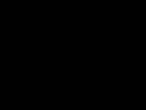

# Dexterous Gym - Challenging Extensions to OpenAI's Gym Hand Manipulation Environments
This repository contains a number of challenging environments based on OpenAI's Gym hand manipulation tasks, all of which are challenging for current RL and trajectory optimisation techniques. The GIFs of example solutions for some of the environments come from a soon-to-be published custom trajectory optimisation technique I have developed.

## Installation
Requirements: [Mujoco-py](https://github.com/openai/mujoco-py) and [Gym](https://github.com/openai/gym)
Once these are installed, run `pip install dexterous-gym`.
Alternatively, clone the repository and run `pip install -e .` from within the main directory.

## Example usage
```
import gym
import dexterous_gym
env = gym.make("EggCatchUnderarm-v0")
```
See `dexterous_gym/__init__.py` for full list of registered environments. See `dexterous_gym/examples/test_all_envs.py` to run all available environments with random actions.

## Environments
### Standard RL environments

We include one "standard" RL environment (i.e. an environment which is not conditioned on a goal), PenSpin.

\
<b>Variants</b>: "PenSpin-v0". 

This is a simple modification of the OpenAI gym HandPen environment where all we do is change the observation space to remove any notion of a goal and then define a custom reward function. This reward function encourages the pen to be spun whilst remaining horizontal.

### Goal-based environments
A  majority of the environments are goal-based, and have a similar API to the openAI Gym manipulation environments (observations are dictionaries with "observation", "achieved_goal", "desired_goal"). In the case of the two object environments "achieved_goal" and "desired_goal" are also dictionaries with entries "object_1" and "object_2". All environments come with a standard dense-reward setting (where the reward is defined in terms of the positional and rotational distance between the achieved goal(s) and the desired goal(s) as well as a sparse setting, where the reward is -1.0 until the goal(s) are achieved (at which point the reward is 0.0).

#### HandOver Environments

<b>Variants</b>: "EggHandOver-v0", "BlockHandOver-v0", "PenHandOver-v0", "EggHandOverSparse-v0", "BlockHandOverSparse-v0", "PenHandOverSparse-v0" <br/><br/>
These environments involve two fixed-position hands. The hand which starts with the object must find a way to hand it over to the second hand, since the goals are chosen such that only the second hand can move the object to the target position/orientation. The object can be an egg, a block or a pen. 

&nbsp;
&nbsp;

#### HandCatchUnderarm Environments

<b>Variants</b>: "EggCatchUnderarm-v0", "BlockCatchUnderarm-v0", "PenCatchUnderArm-v0", "EggCatchUnderarmHard-v0", "BlockCatchUnderarmHard-v0", "PenCatchUnderarmHard-v0", "EggCatchUnderarmSparse-v0", "BlockCatchUnderarmSparse-v0", "PenCatchUnderArmSparse-v0", "EggCatchUnderarmHardSparse-v0", "BlockCatchUnderarmHardSparse-v0", "PenCatchUnderarmHardSparse-v0" <br/><br/>
These environments again have two hands, however now they have some additional degrees of freedom that allows them to translate/rotate their centre of masses within some constrained regions. The aims of these tasks is to throw the object from one hand to the other, which can then move it to the desired position/rotation. The "Hard" versions just mean that there is a greater distance between the two hands, such that the objects must be thrown further.

#### HandCatchOverarm Environments
<b>Variants</b>: "EggCatchOverarm-v0", "BlockCatchOverArm-v0", "PenCatchOverarm-v0", "EggCatchOverarmSparse-v0", "BlockCatchOverarmSparse-v0", "PenCatchOverarmSparse-v0" <br/><br/>
Similar to the HandCatchUnderArm environments but now the two hands are upright, and so the throwing/catching technique that has to be employed is different. TODO: add "harder" (i.e. further separation between hands) version of these environments, and run some tests with my trajectory optimisation algorithm.

#### TwoObjectCatch Environments

<b>Variants</b>: "TwoEggCatchUnderArm-v0", "TwoBlockCatchUnderArm-v0", "TwoPenCatchUnderArm-v0", "TwoEggCatchUnderArmSparse-v0", "TwoBlockCatchUnderArmSparse-v0", "TwoPenCatchUnderArmSparse-v0" <br/><br/>
These environments involve coordination between the two hands so as to throw the two objects over to the other hands (as each object's goal can only be reached by the other hand). TODO: introduce "harder" and overarm versions of these environments. Also, note that the examples shown were generated when there was an error with the environment - need to re-run experiment now this is fixed.
